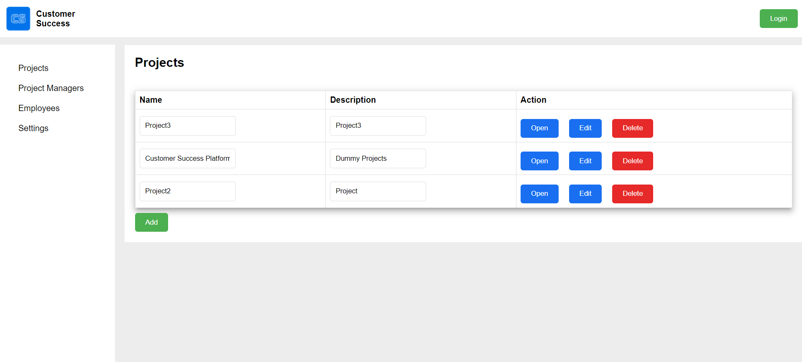
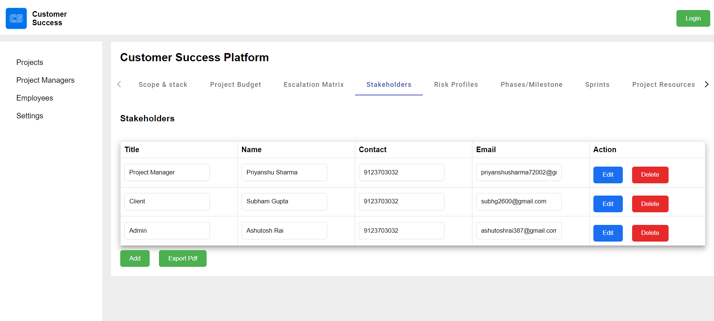
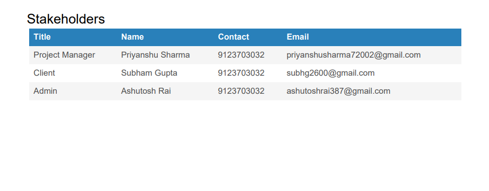
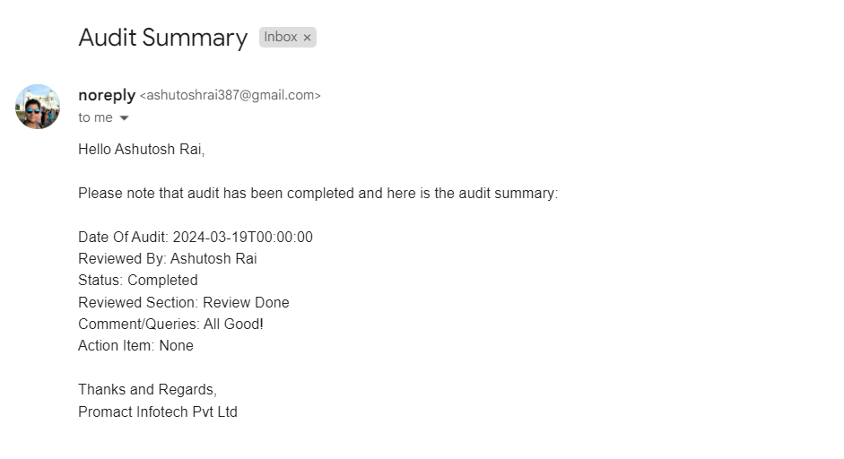

# Promact.CustomerSuccess.Platform
A Customer success platform is a formal document that outlines the objectives, scope, stakeholders, and key deliverables of a project. It serves as a foundational document that provides clarity and direction to all project stakeholders, including team members, sponsors, and clients.

This project revolves around the development of the **Customer Success Platform Application**. This application will allow the Stakeholders to view all the details and updates about the Projects in real time. 

### Project Overview
1. Technical Implementation: The development of the application using Angular and .NET)
2. Email Notification System: The functionality to send email notifications to stakeholders whenever there is a change or update within the application.
3. Import as a Document: The 'Import as a Document' feature which allows the stakeholders to import updates as documents for offline reference.
4. User Interface Development: Creating a user-friendly interface for stakeholders to view updates related to the project.

### Reasons for Developing This Application
The Customer Success Platform Application is being developed to address the following needs and objectives:
1. Enhanced Communication: To improve communication and transparency by keeping stakeholders informed about relevant updates or changes within our system.
2. Efficiency: To automate the process of notifying stakeholders, saving time and effort compared to manual notification methods.
3. Improved Stakeholder Engagement: By providing stakeholders with timely updates, we aim to increase their engagement and satisfaction with our services.
4. Competitive Advantage: By implementing this application, we can differentiate ourselves from competitors by offering a more transparent and responsive communication process.

## Working of the Project
### Dashboard


This is the dashboard of the Customer Success Project. It will display all the Projects that are currently there. It also has the option to add a new project or edit the name and description of existing ones. The Delete Button will delete the Project. The Open Button will load the details related to the project.

### Project Details


On clicking the **Open** button in dashboard will open the details of that particular project. The Project Name(**Customer Success Platform** as example here) will be displayed on top. Below the Project name is a navbar which categorises the various informations related to the project (The details of Project Stakeholders is being displayed here as example. It provides the functionality to add, delete and update data columns for any particular field.  

### Export Pdf


On clicking the **Export Pdf** button will generate the pdf document for the data being displayed. This is the image of the pdf document for the **Stakeholders** table data.

### Email Notification


On making any changes like adding new data or editing existing ones will automatically send email notifications to the stakeholders of the project. Given above is the image of the email notification being received.  

## About this solution(Frontend)

This project was generated with [Angular CLI](https://github.com/angular/angular-cli) version 17.1.3.

### Development server

Run `ng serve` for a dev server. Navigate to `http://localhost:4200/`. The application will automatically reload if you change any of the source files.

### Code scaffolding

Run `ng generate component component-name` to generate a new component. You can also use `ng generate directive|pipe|service|class|guard|interface|enum|module`.

### Build

Run `ng build` to build the project. The build artifacts will be stored in the `dist/` directory.

### Running unit tests

Run `ng test` to execute the unit tests via [Karma](https://karma-runner.github.io).

### Running end-to-end tests

Run `ng e2e` to execute the end-to-end tests via a platform of your choice. To use this command, you need to first add a package that implements end-to-end testing capabilities.

### Further help

To get more help on the Angular CLI use `ng help` or go check out the [Angular CLI Overview and Command Reference](https://angular.io/cli) page.

##

##

## About this solution(Backend)

This is a minimalist, non-layered startup solution with the ABP Framework. All the fundamental ABP modules are already installed. 

### Pre-requirements

* [.NET 8.0+ SDK](https://dotnet.microsoft.com/download/dotnet)
* [Node v18 or 20](https://nodejs.org/en)

### Configurations

The solution comes with a default configuration that works out of the box. However, you may consider to change the following configuration before running your solution:

* Check the `ConnectionStrings` in `appsettings.json` files under the `Promact.CustomerSuccess.Platform` project and change it if you need.

### Before running the application

#### Generating a Signing Certificate

In the production environment, you need to use a production signing certificate. ABP Framework sets up signing and encryption certificates in your application and expects an `openiddict.pfx` file in your application.

This certificate is already generated by ABP CLI, so most of the time you don't need to generate it yourself. However, if you need to generate a certificate, you can use the following command:

```bash
dotnet dev-certs https -v -ep openiddict.pfx -p a2a5a8af-14c6-4374-a8f3-908165814c47
```

> `a2a5a8af-14c6-4374-a8f3-908165814c47` is the password of the certificate, you can change it to any password you want.

It is recommended to use **two** RSA certificates, distinct from the certificate(s) used for HTTPS: one for encryption, one for signing.

For more information, please refer to: https://documentation.openiddict.com/configuration/encryption-and-signing-credentials.html#registering-a-certificate-recommended-for-production-ready-scenarios

> Also, see the [Configuring OpenIddict](https://docs.abp.io/en/abp/latest/Deployment/Configuring-OpenIddict#production-environment) documentation for more information.

#### Install Client-Side Libraries

Run the following command in the directory of your final application:

```bash
abp install-libs
```

> This command installs all NPM packages for MVC/Razor Pages and Blazor Server UIs and this command is already run by the ABP CLI, so most of the time you don't need to run this command manually.

### How to Run

The application needs to connect to a database. Run the following command in the `Promact.CustomerSuccess.Platform` directory to migrate the database and seed the initial data:

````bash
dotnet run --migrate-database
````

This command will create and seed the initial database. Then you can run the application with any IDE that supports .NET.

### Deploying the application

Deploying an ABP application is not different than deploying any .NET or ASP.NET Core application. However, there are some topics that you should care about when you are deploying your applications. You can check ABP's [Deployment documentation](https://docs.abp.io/en/abp/latest/Deployment/Index) before deploying your application.

### Additional resources

You can see the following resources to learn more about your solution and the ABP Framework:

* [Application (Single Layer) Startup Template](https://docs.abp.io/en/abp/latest/Startup-Templates/Application-Single-Layer)
* [LeptonX Lite Angular UI](https://docs.abp.io/en/abp/latest/Themes/LeptonXLite/Angular)
